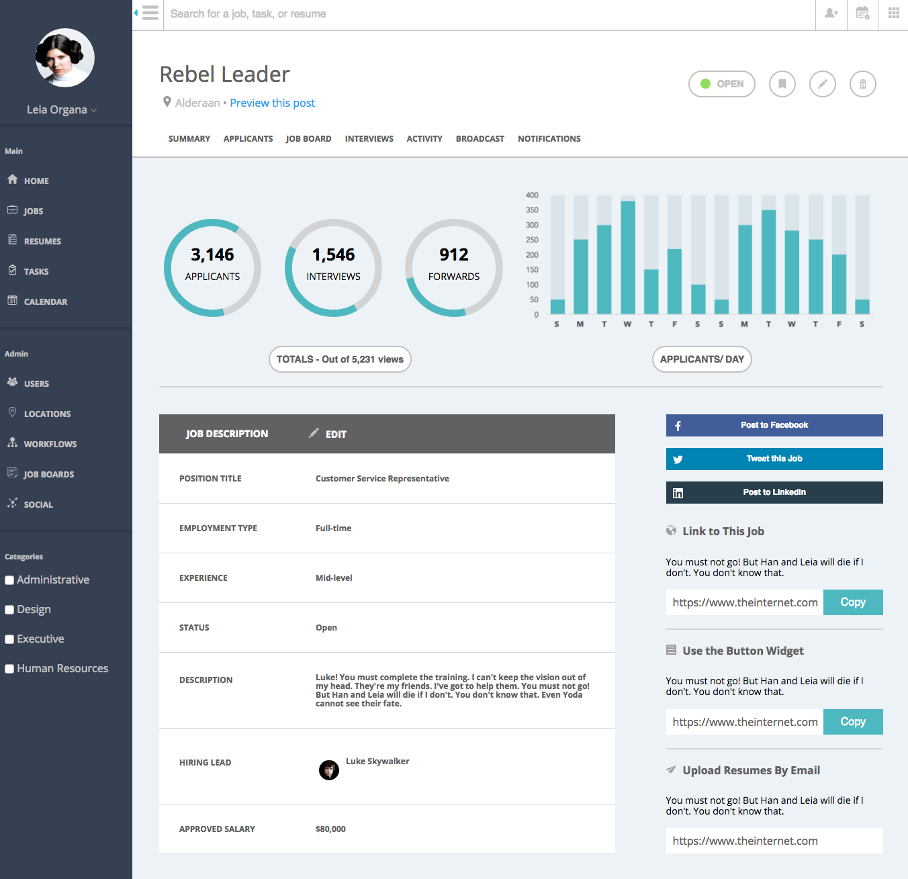

# mf-static-comp-2

This project aims to recreate a static site based on a provided comp. Some small liberties were taken with the design re: colors, icons, photos, and copy, but not with the layout. The site aims to be responsive at several separate breakpoints and the layout has been considered at these breakpoints to maximize ease of use.

Special consideration on this project was given toward accessibility markup, refactoring and code conventions, and careful positioning in the comp.

### Comp to Recreate

### Final Comp

